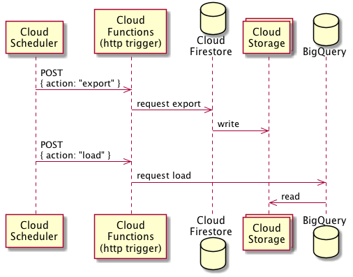

@pokutuna/firestore-to-bigquery
===

[](https://github.com/pokutuna/firestore-to-bigquery/actions)
[](https://www.npmjs.com/package/@pokutuna/firestore-to-bigquery)

A utility for periodically export Cloud Firestore & Datastore and load to BigQuery.



## Create a bucket on Cloud Storage

- The locations must be same as Cloud Firestore (Datastore).
- (Recommend) Set the TTL rule to the bucket to delete exported objects.
  - [Object Lifecycle Management  |  Cloud Storage  |  Google Cloud](https://cloud.google.com/storage/docs/lifecycle)

## Create a function on Cloud Functions

```js
const { makeFunction } = require('@pokutuna/firestore-to-biguqery');

// Function to deploy Cloud Functions with http trigger
export const app = makeFunction({
  // Your projectId.
  projectId: "my-project",
  // Names of kind (Datastore mode) or collection (Firestore mode).
  kinds: ["foo", "bar"],
  // GCS Bucket. Must be same location as Firestore.
  exportBucket: "my-bucket",

  // BigQuery
  destination: {
    datasetId: "datastore",
    // The location for creating dataset if not present.
    location: "asia-northeast1",
  },
  // Callback for partitioning.
  timePartitionedBy: (kind) => {
    if (kind === "foo") return { field: "createdAt" };
    return undefined;
  },
});
```

`$ gcloud functions deploy firestore-to-bigquery --entry-point=app --runtime=nodejs10 --trigger-http`

### Required Roles

- `roles/datastore.importExportAdmin`
- `roles/storage.admin`
- `roles/bigquery.user`

Give these roles to runtime service account on Cloud IAM.  
Use the default service account `PROJECT_ID@appspot.gserviceaccount.com` OR create and deploy with another service account `--service-account=...`

[Function Identity  |  Cloud Functions Documentation  |  Google Cloud](https://cloud.google.com/functions/docs/securing/function-identity)


## Create 2 schedulers on Create Scheduler

### Export Firestore
```
$ gcloud scheduler jobs create http kick-export \
  --time-zone "Asia/Tokyo" \
  --schedule="17 2 * * *" \
  --uri="{YOUR_FUNCTION_URL}" \
  --headers="Content-Type=application/json" \
  --http-method="POST" \
  --message-body='{ "action": "export" }'
```

### Load to BigQuery
```
$ gcloud scheduler jobs create http kick-load \
  --time-zone "Asia/Tokyo" \
  --schedule="23 4 * * *" \
  --uri="{YOUR_FUNCTION_URL}" \
  --headers="Content-Type=application/json" \
  --http-method="POST" \
  --message-body='{ "action": "load" }'
```

See also [Creating and configuring cron jobs  |  Cloud Scheduler Documentation](https://cloud.google.com/scheduler/docs/creating)
